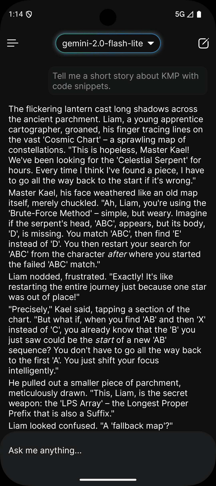
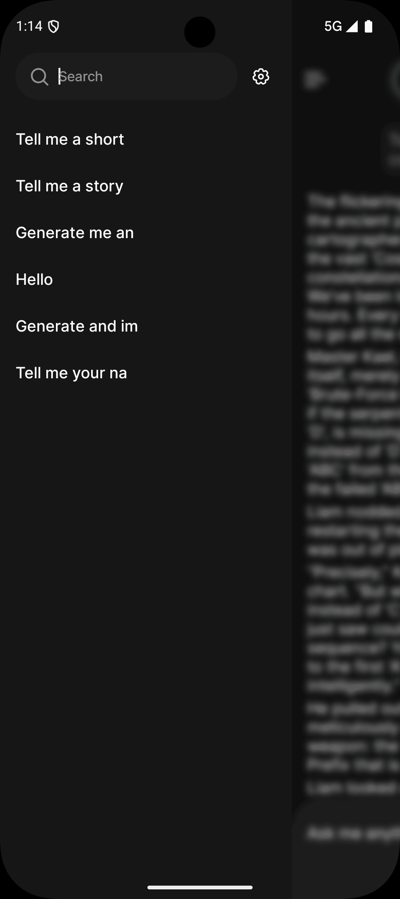
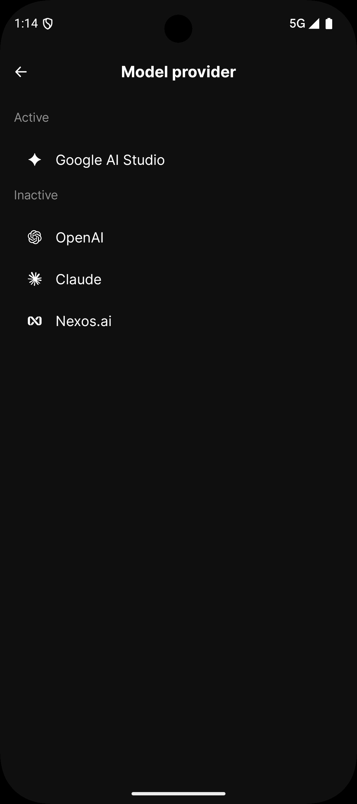
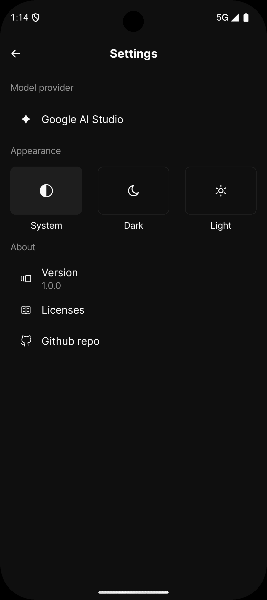

# LM Client

A cross-platform chat interface for language models built with Kotlin/Compose Multiplatform.


## Disclaimer

**This project is not vibe-coded! While LLMs helped with some repetitive tasks, all code was carefully reviewed and written by a human.**
This is a personal side project I work on in my free time to learn new technologies and experiment with Kotlin Multiplatform. It's far from perfect and there are likely many things that could be done better. If you spot something wrong or have suggestions for improvements, feel free to create a merge request.

## Features

- **Cross-Platform** - Native apps for Android, iOS, and Desktop from a single codebase
- **Multiple AI Providers** - OpenAI, Google, Anthropic, Nexos AI
- **Streaming Responses** - Real-time streaming chat with markdown rendering
- **Local Storage** - Offline message history and settings persistence
- **Modern Stack** - Compose Multiplatform, Decompose, SQLDelight, Ktor, Koin, Arrow-kt

## Screenshots

| Chat | History | Model Providers | Settings |
|:----:|:-------:|:---------------:|:--------:|
|  |  |  |  |

## In progress

1. [ ] Support for OpenRouter, Ollama, DeepSeek, providers
2. [ ] Image attachments (input/output)
3. [ ] Audio attachments (input/output)
4. [ ] File attachments (output)
5. [ ] Separate Desktop design

## Getting Started

### Prerequisites

- JDK 21 or higher
- Android SDK (for Android development)
- Xcode (for iOS development, macOS only)

### Run

```bash
# Desktop
./gradlew :shared:run

# Android APK
./gradlew :androidApp:assembleDebug

# iOS - open in Xcode
open iosApp/iosApp.xcodeproj
```

### Test

```bash
./gradlew :shared:jvmTest
./gradlew detektAll
```

## Project Structure

```
LM-Client/
├── shared/          # Multiplatform shared code
├── androidApp/      # Android application
├── iosApp/          # iOS Xcode project
└── gradle/          # Build configuration
```

See [CLAUDE.md](CLAUDE.md) for detailed architecture documentation.

## Contributing

1. Fork the repository
2. Create a feature branch: `git checkout -b feature/my-feature`
3. Make changes and run `./gradlew detektAll`
4. Commit and push: `git commit -m 'Add feature' && git push origin feature/my-feature`
5. Open a Pull Request

## Acknowledgments

- [JetBrains](https://www.jetbrains.com/) for Kotlin Multiplatform and Compose Multiplatform
- [Koog Framework](https://github.com/JetBrains/koog) for AI agent capabilities
- [Decompose](https://github.com/arkivanov/Decompose) by [@arkivanov](https://github.com/arkivanov) for navigation and component architecture
- [Koin](https://github.com/InsertKoinIO/koin) for dependency injection
- [Haze](https://github.com/chrisbanes/haze) by [@chrisbanes](https://github.com/chrisbanes) for blur effects
- [SQLDelight](https://github.com/cashapp/sqldelight) by Cash App for multiplatform database
- [Multiplatform Markdown Renderer](https://github.com/mikepenz/multiplatform-markdown-renderer) by [@mikepenz](https://github.com/mikepenz) for markdown rendering
- All the amazing open-source libraries that make this project possible
